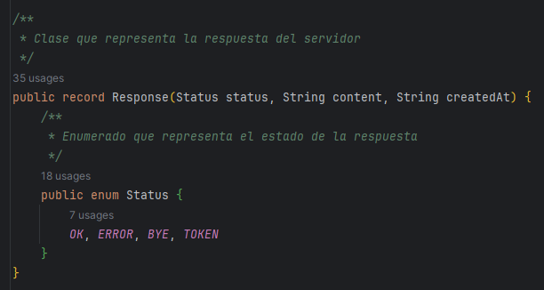
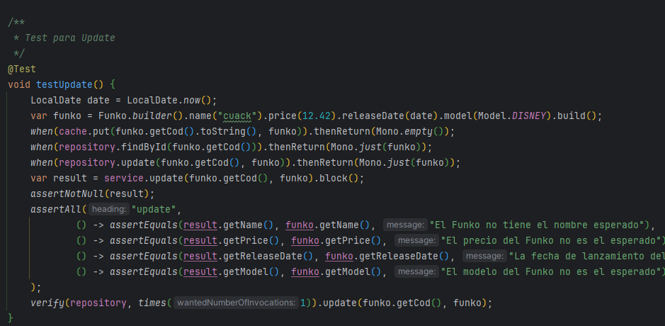

# Funko Sockets Server

  

[Ver cliente](https://github.com/Madirex/funkos-sockets-client)

## 📝 Descripción

Servidor de Sockets API Rest de Funkos programada en Java con Gradle, Spring Boot y base de datos en H2 (modificable desde el archivo properties). Se
realizan tests con JUnit y Mockito.

## 💡 Instrucciones de uso

- ⚠ **.env:** Este fichero se deberá de crear en la carpeta raíz con los siguientes datos:
  DATABASE_USER=usuario
  DATABASE_PASSWORD=contraseña
  Deberás de modificar el usuario y la contraseña que quieres que tenga la base de datos. La razón por la que el .env no
  se agrega al repositorio es por motivos de seguridad. Estos datos están aislados del database.properties.

- **database.properties (java/resources):** Este fichero es el que se deberá modificar si se quiere cambiar la URL, el driver, el nombre
  de la base de datos o si se quiere forzar el reinicio de la tabla Funko en el inicio del programa (eliminará y volverá
  a crear la tabla de Funko).
- **server.properties (java/resources):** Este fichero es el que se deberá modificar si se quiere cambiar el puerto del servidor, los datos del Token y del Keyfile.

## Servidor

### Implementación

Este método inicializa el servidor.

  

Este método se encarga de cargar los Funkos e insertarlos en la base de datos.

  

Este método se encarga de cargar los datos del archivo de configuración.

  

Este método se encarga de cargar el sistema de notificaciones.

  

Este método inicializa el programa.

  

Este método agrega los usuarios por defecto para poder administrar la base de datos desde el cliente.

  

Este es un ejemplo de un método GetByModel (Request al servidor)

  

Así se manejan las peticiones:

  

Con este método se cierra la conexión:

  

Con este método se abre la conexión:

  

Este método sirve para verificar el Token.

  

Estos son los métodos para manejar la lógica de los Usuarios.

  

Este es un ejemplo de repositorio. Consulta FindById:

  

Hay varios Record como, por ejemplo, Response, que se encarga de administrar el tipo de respuesta en contacto con el cliente.

  

Por último, esto es un ejemplo de un método del controlador, que valida el Funko y llama al servicio para realizar la acción de guardado:

  

### Tests
Algunos de los tests de la aplicación:

  

  

  

  

  

  

## ⚙ Herramientas

- Java 17.
- Gradle.
- H2.
- JUnit.
- Mockito.
- DotEnv.
- Lombok.
- Logback.
- Gson.
- Mybatis.
- Spring Boot.
- R2DBC
- Jbcrypt
- JWT
- Reactor Core

## 🗂️ Organización

- Controllers: Se encargan de recibir las peticiones del usuario y devolver la respuesta correspondiente.
- Exceptions: Se encargan de definir las excepciones que se van a utilizar en la aplicación.
- Models: Se encargan de definir los objetos que se van a utilizar en la aplicación.
- Repositories: Se encargan de realizar las operaciones con la base de datos.
- Server: Se encarga de definir el servidor. Contiene el paquete de JWT, de notificaciones y el handler del cliente.
- Services: Se encargan de realizar las operaciones necesarias para que el controlador pueda devolver la respuesta.
- Utils: Se encargan de definir las clases útiles que se van a utilizar en la aplicación.
- Validators: Se encargan de validar los objetos que se van a utilizar en la aplicación.
- FunkoProgram: El programa que ejecuta el funcionamiento de la aplicación.
- Main: El programa que ejecutará la aplicación.

## 🛠️ Utils

El paquete Utils incluye las siguientes utilidades:

- ApplicationProperties: Se encarga de leer el archivo properties y devolver los valores de las propiedades.
- LocalDateAdapter: Se encarga de convertir un LocalDate a un String y viceversa.
- LocalDateTimeAdapter: Se encarga de convertir un LocalDateTime a un String y viceversa.
- Utils: Se encarga de definir métodos útiles para la aplicación.

## 🔄 Services

Incluye tres paquetes:

- Cache: Se encarga de definir la interfaz y la implementación de la caché.
- CRUD: Base del CRUD y Operaciones CRUD de FUNKOS.
- Database: Se almacena el Manager de la base de datos.
- IO: Se almacena la clase CsvManager para leer un archivo CSV.

## #️⃣ Server

- JWT: Se encarga de definir la interfaz y la implementación de JWT.
- Notifications: Se encarga de definir la interfaz y la implementación de las notificaciones.
- ClientHandler: Se encarga de definir el handler del cliente.

## 🔍 Operaciones CRUD

- FindAll: Se encarga de devolver todos los Funkos.
- FindById: Se encarga de devolver un Funko por su id.
- FindByName: Se encarga de devolver un Funko por su nombre.
- Save: Se encarga de guardar un Funko.
- Update: Se encarga de actualizar un Funko.
- Delete: Se encarga de eliminar un Funko.

## Ejecución

  

