# Funkos Java Reactivos

  

[Ver versión síncrona](https://github.com/Madirex/Funkos-Rest-Synchronous)

[Ver versión asíncrona](https://github.com/Madirex/Funkos-Rest-Async)

## 📝 Descripción

API Rest de Funkos programada en Java con Gradle y base de datos en H2 (modificable desde el archivo properties). Se
realizan tests con JUnit y Mockito, además de varias consultas en el Main de la aplicación para probar tanto los casos
correctos como los incorrectos del programa.

## 💡 Instrucciones de uso

- ⚠ **.env:** Este fichero se deberá de crear en la carpeta raíz con los siguientes datos:
  DATABASE_USER=usuario
  DATABASE_PASSWORD=contraseña
  Deberás de modificar el usuario y la contraseña que quieres que tenga la base de datos. La razón por la que el .env no
  se agrega al repositorio es por motivos de seguridad. Estos datos están aislados del database.properties.

- **database.properties:** Este fichero es el que se deberá modificar si se quiere cambiar la URL, el driver, el nombre
  de la base de datos o si se quiere forzar el reinicio de la tabla Funko en el inicio del programa (eliminará y volverá
  a crear la tabla de Funko).

## Reactividad

### Implementación

Se ha cambiado JDBC por R2DBC para realizar la reactividad. El DatabaseManager ha cambiado. Además, se ha cambiado el
Pool de conexiones a R2DBC-Pool.

  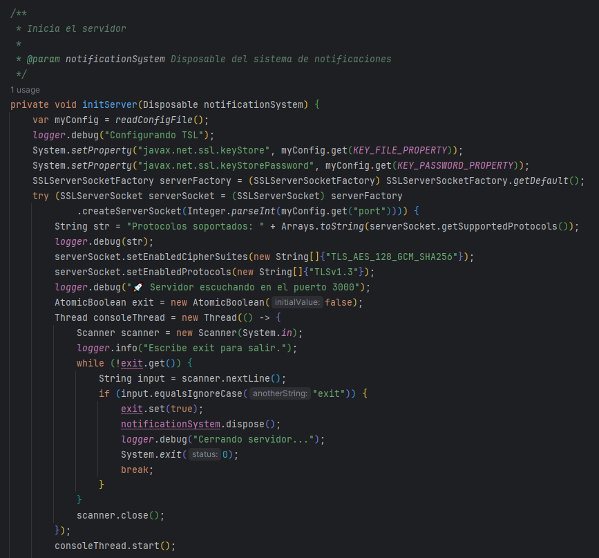

  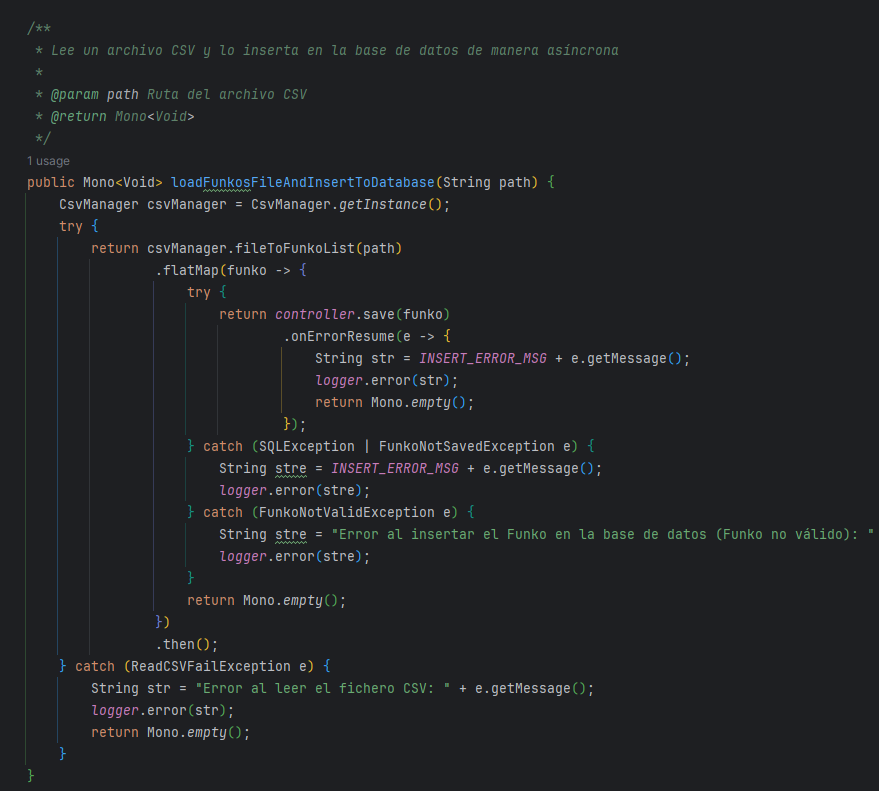

Ahora cada consulta se realiza por separado. Primero se ejecuta la consulta SQL de eliminación en el caso de que exista
ya la tabla. Se hace un block para evitar que el programa siga ejecutándose y luego se ejecuta el SQL de inicialización
de la tabla de Funko.

  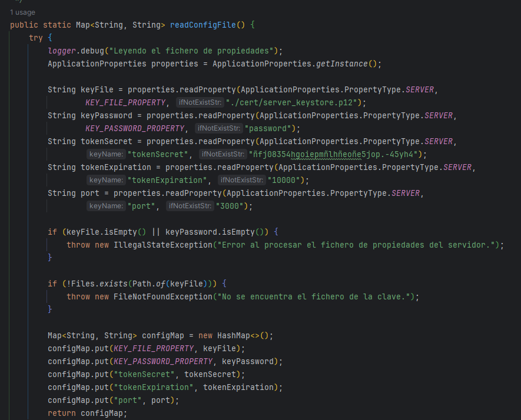

Este es un ejemplo de un repositorio reactivo. Se utiliza Mono.usingWhen para realizar la consulta que retorna un
Boolean. En los repositorios que retornaban listas ahora retornan un Flux (flujo). Los que antes retornaban Optional
ahora retornan Mono.

  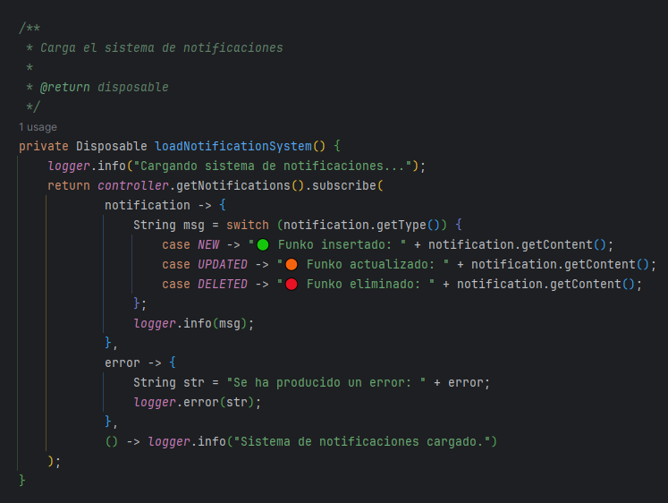

Este es un ejemplo del servicio, llamando al repositorio. En el caso de que no exista, lanza una excepción de manera
reactiva (FunkoNotFoundException). A continuación, se realiza un flatMap para asignarle a la caché el elemento y
retornarlo. En el caso de que la operación se haya realizado correctamente se creará una notificación. El sistema de
notificaciones también ha sido agrgeado en esta versión reactiva (lo explicaré más adelante).

  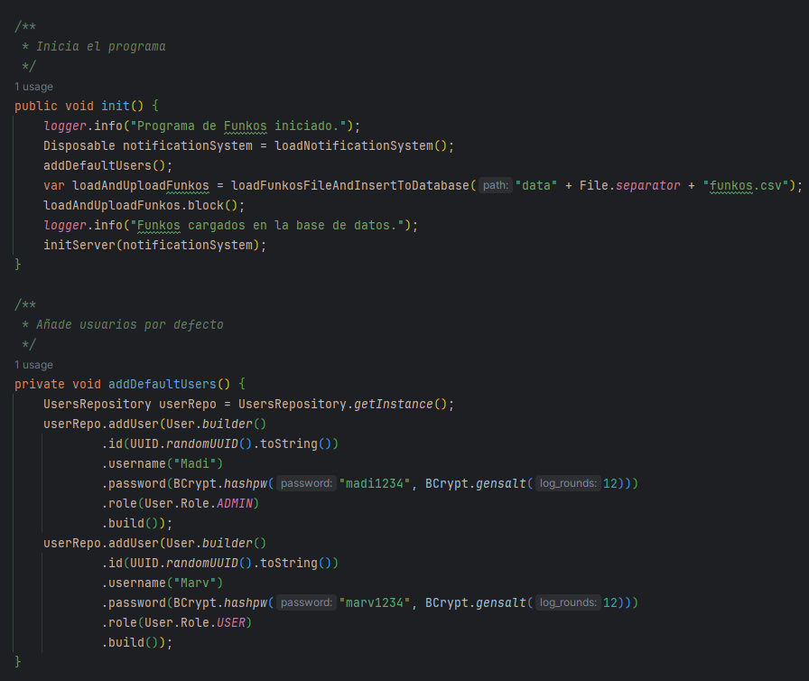

Este es un ejemplo de un controlador. El save hace un log de depuración con los datos que serán guardados. A
continuación, se valida y finalmente se le llama al servicio para que retorne el Mono de Funko.

  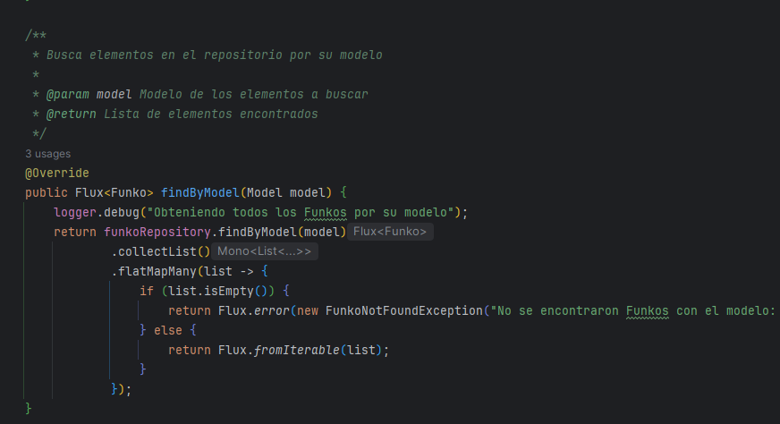

En el caso del caché, se le ha agregado reactividad uitlizando Mono.fromRunnable y retornando el Mono<Void> para
manejarlo después.

Además, también se ha modificado el caché para que en lugar de 10 elementos, almacene 15. La expiración cambia también a
90 segundos.

  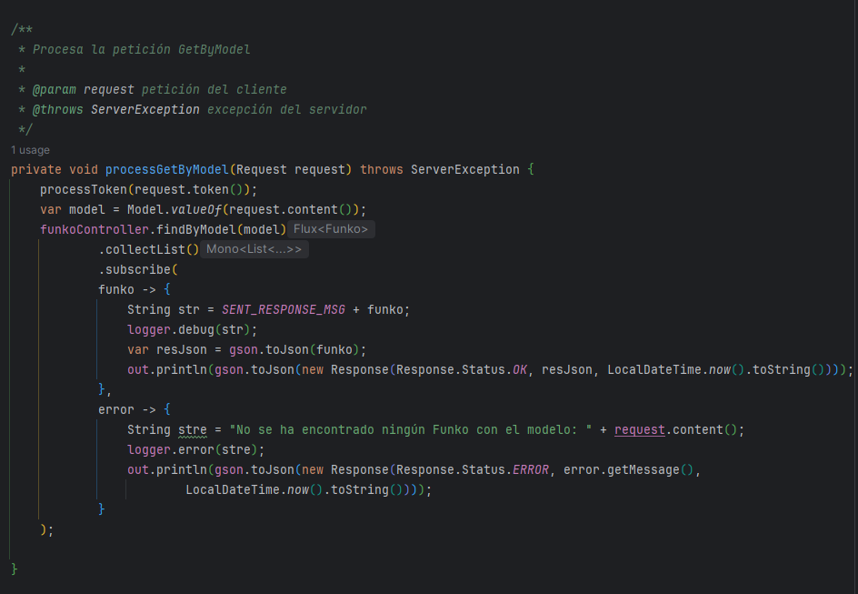

Para la exportación del backup se utiliza un Mono.defer para retrasar la ejecución hasta ser suscrito al flujo. De esta
manera, solo se ejecutará al ser suscrito.
En el caso de que el directorio no exista, se lanzará una excepción de manera reactiva.

  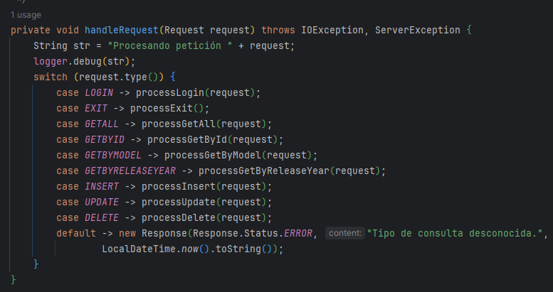

El método de lectura de los datos CSV se lee utilizando Flux from Stream.

  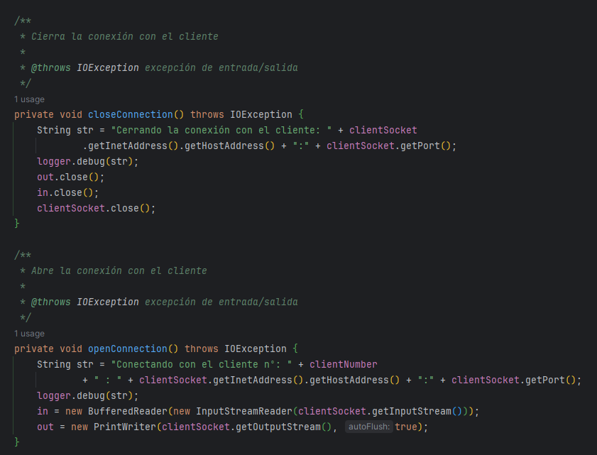

Como mencioné antes, se agregó un sistema de notificaciones. El controlador llama al servicio y el servicio cuenta con
un método para notificar. Este método llama al sistema de notificaciones para ejecutar la notificación.

  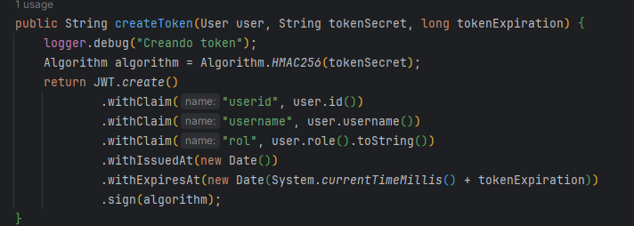

El modelo de notificación es el siguiente. Almacena un tipo enum que puede ser "new, updated o deleted". De esta manera,
se podrá notificar al usuario de las acciones que se vayan realizando.

  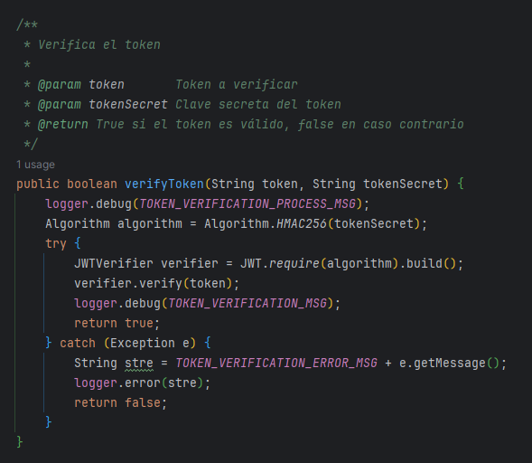

Este servicio de notificaciones se inyecta en el servicio de implementación de Funko.

  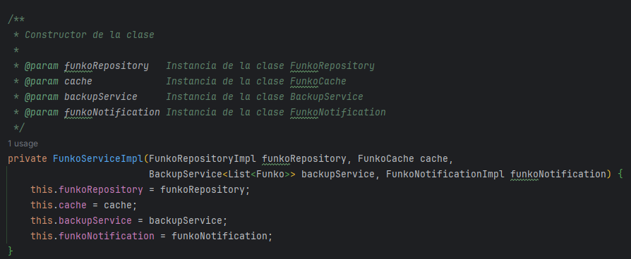

En la clase principal de la aplicación (FunkoProgram) he creado un método para cargar el sistema de notificación y sus
casos.

  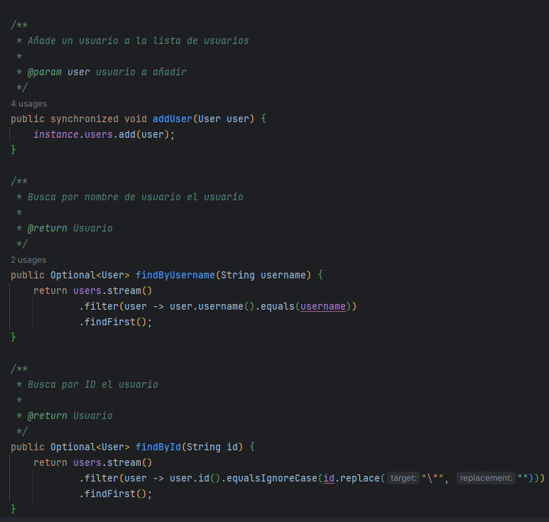

Ahora al inicializar el programa, se utiliza block para bloquear el programa hasta que se carguen los datos en la base
de datos para poder trabajar con ellos posteriormente.

  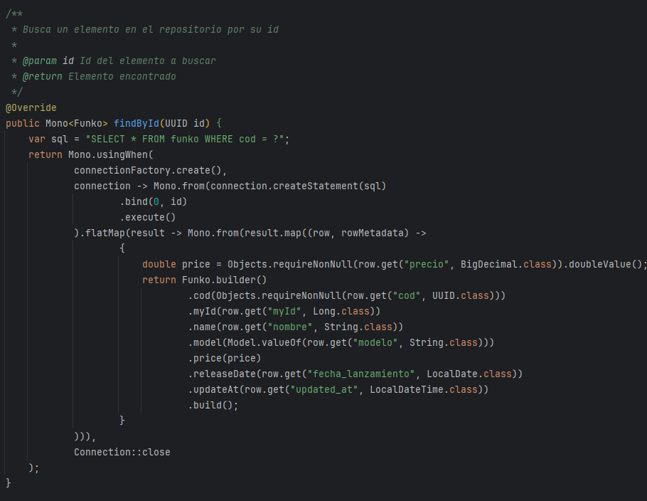

Este es un ejemplo de una consulta API Stream que calcula la media del precio de los Funkos:

  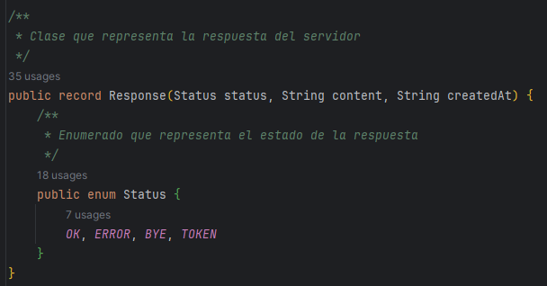

### Tests Reactivos

Ejemplo de test de exportar datos. En cada test se debe de hacer block para evitar que el test termine antes de que se
ejecute el método exportData.

  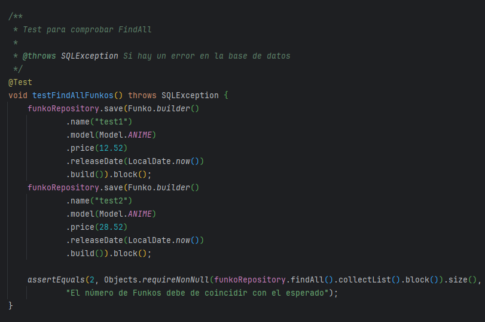

Un ejemplo del método clear del caché testeado. Se hace un put del caché y se bloquea antes de continuar. De esta
manera, nos aseguramos de que el caché se asigne antes de que el programa siga ejecutándose. Lo mismo sucede con el
método get.

  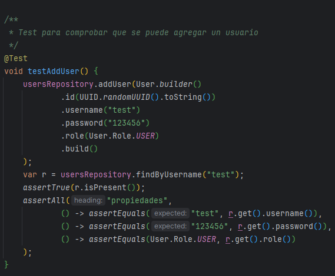

Este es un ejemplo de un test de repositorio. Se guarda el elemento en el repositorio y se hace block. Luego se
comprueba que se haya asignado correctamente. Se hace un update para actualizar los datos previamente guardados (
utilizando block para esperar a que lo realice antes de continuar). Y, finalmente, se hace un findById para ver si el
cambio se ha realizado correctamente.

  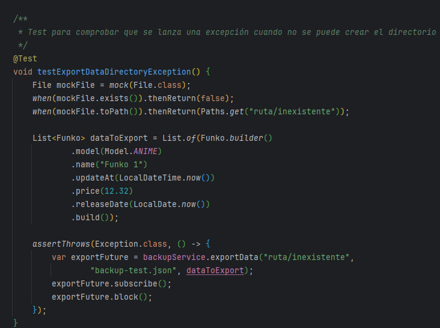

Ejemplo de prueba de excepción en el servicio. Se comprueba el FunkoNotFoundException.

  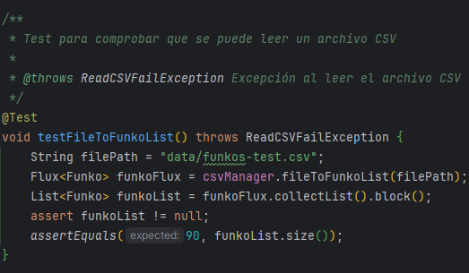

Ejemplo de prueba de caso correcto de FindByName. Se utiliza mockito para el repositorio. Se realiza un collectList a
findByName y se bloquea antes de hacer las comprobaciones. Finalmente, se verifica que solo se haya ejecutado una vez.

  

## ⚙ Herramientas

- Java 11.
- Gradle.
- H2.
- JUnit.
- Mockito.
- DotEnv.
- Lombok.
- Logback.
- Gson.
- Mybatis.

## 🗂️ Organización

- Controllers: Se encargan de recibir las peticiones del usuario y devolver la respuesta correspondiente.
- Exceptions: Se encargan de definir las excepciones que se van a utilizar en la aplicación.
- Models: Se encargan de definir los objetos que se van a utilizar en la aplicación.
- Repositories: Se encargan de realizar las operaciones con la base de datos.
- Services: Se encargan de realizar las operaciones necesarias para que el controlador pueda devolver la respuesta.
- Utils: Se encargan de definir las clases útiles que se van a utilizar en la aplicación.
- Validators: Se encargan de validar los objetos que se van a utilizar en la aplicación.
- FunkoProgram: El programa que ejecutará todas las consultas necesarias para probar el funcionamiento de la aplicación.
- Main: El programa que ejecutará la aplicación.

## 📊 Consultas API Stream

Las consultas se realizan en la clase FunkoProgram. Cada consulta interacciona con la base de datos y devuelve el
resultado de la consulta. Se prueban tanto los casos incorrectos como los incorrectos.

- Funko más caro.
- Media de precio de Funkos.
- Funkos agrupados por modelos.
- Número de Funkos por modelos.
- Funkos que han sido lanzados en 2023.
- Número de Funkos de Stitch.
- Listado de Funkos de Stitch.

## 🛠️ Utils

El paquete Utils incluye las siguientes utilidades:

- ApplicationProperties: Se encarga de leer el archivo properties y devolver los valores de las propiedades.
- LocalDateAdapter: Se encarga de convertir un LocalDate a un String y viceversa.
- LocalDateTimeAdapter: Se encarga de convertir un LocalDateTime a un String y viceversa.
- Utils: Se encarga de definir métodos útiles para la aplicación.
- UuidAdapter: Se encarga de convertir un UUID a un String y viceversa.

## 🔄 Services

Incluye tres paquetes:

- CRUD: Base del CRUD y Operaciones CRUD de FUNKOS.
- Database: Se almacena el Manager de la base de datos.
- IO: Se almacena la clase CsvManager para leer un archivo CSV.

## ⚠️ Exceptions

El programa incluye las siguientes excepciones personalizadas:

- FunkoException: Excepción base de la aplicación.
- CreateFolderException: Exception que se lanza cuando no se puede crear una carpeta.
- FunkoNotFoundException: Exception que se lanza cuando no se encuentra un Funko.
- FunkoNotSavedException: Exception que se lanza cuando no se puede guardar un Funko.
- FunkoNotValidException: Exception que se lanza cuando un Funko no es válido.
- ReadCSVFailException: Exception que se lanza cuando no se puede leer un archivo CSV.

## 🔍 Operaciones CRUD

- FindAll: Se encarga de devolver todos los Funkos.
- FindById: Se encarga de devolver un Funko por su id.
- FindByName: Se encarga de devolver un Funko por su nombre.
- Save: Se encarga de guardar un Funko.
- Update: Se encarga de actualizar un Funko.
- Delete: Se encarga de eliminar un Funko.
- Backup: Se encarga de realizar un backup de la base de datos.

## Ejecución

  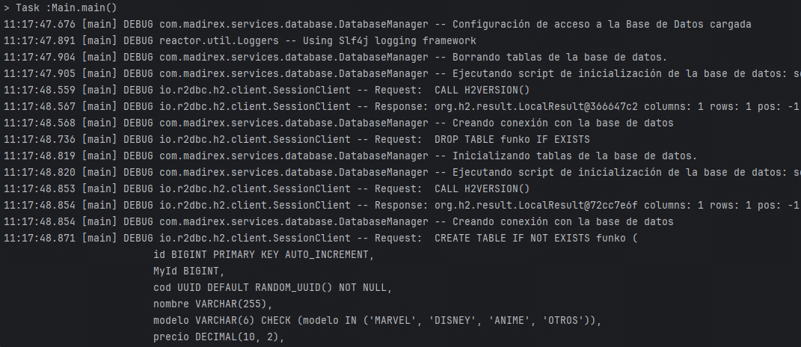

